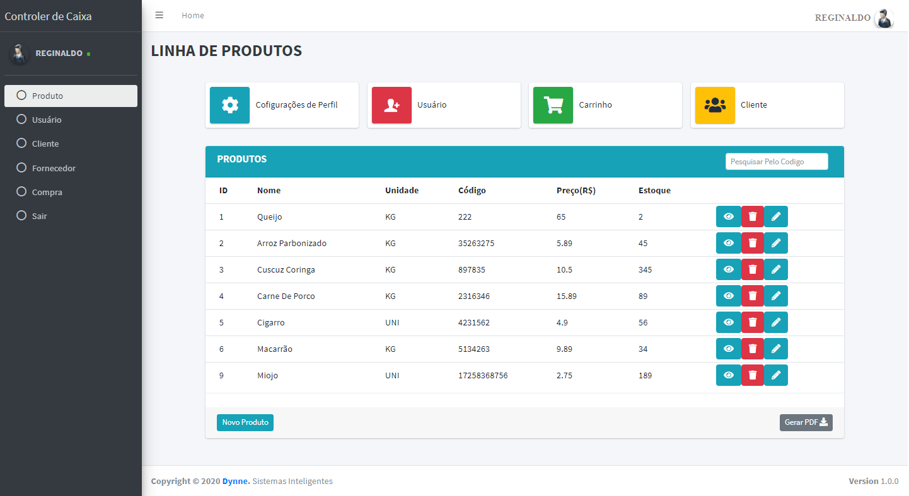

/*

*/

  

    

      
    

  

## About the project

The Inventory Control Designed and built by me, it has the best services and adapted to the needs and requirements of the client or company. Include the best services always following the client's business rule. Provide not only complete inventory control, but a valuable product that generates profits, or that helps sales, leaving it simple and objective. You can find
or hire all this in the services provided by the same profile. Hire me I can be close to you. [Clique Aqui](https://www.instagram.com/reginaldohiss/?hl=pt-br)

## User experience

The project is based on dynamic features to have maximum interactivity with its user, allowing it
better usability containing the following features:

- CADASTRO DE USUÁRIO
- CONFIGURAÇÃO DE USUÁRIO
- EXCLUSÃO DE USUÁRIO
- ATUALIZAÇÃO DE USUÁRIO
- IMPRESSÃO DE USUÁRIOS NO SISTEMA
-------------------------------
- CADASTRO DE PRODUTO
- CONFIGURAÇÃO DE PRODUTO REFERENTE SUA EMPRESA
- EXCLUSÃO DE PRODUTO
- ATUALIZAÇAÕ DE PRODUTO
- IMPRESSÃO DE PRODUTOS NO SISTEMA
-------------------------------
- CADASTRO DE CLIENTE
- CONFIGURAÇÃO DE CLIENTE
- EXCLUSÃO DE CLIENTE
- ATUALIZAÇÃO DE CLIENTE
- IMPRESSÃO DE CLIENTES NO SISTEMA
-------------------------------
- CADASTRO DE FORNECEDOR
- CONFIGURAÇÃO DE FORNECEDOR REFERENTE AO PRODUTO
- EXCLUSÃO DE FORNECEDOR
- ATUALIZAÇÃO DE FORNECEDOR
- IMPRESSÃO DE FORNECEDORES NO SISTEMA
--------------------------------
- CAIXA FINAÇEIRO
- IMPRESSÃO DE COMPRA

## Technologies used in our projects 

We use the best technologies for product performance, as well as good practices. Giving even better usability, stability and total viability. Technologies such as:

- **[HTML, CSS E JAVASCRIPT](https://developer.mozilla.org/pt-BR/docs/Web/HTML)**
- **[BOOTSTRAP](https://getbootstrap.com/)**
- **[LARAVEL](https://laravel.com/)**
- **[PHP](https://www.php.net/)**
- **[MYSQL](https://www.mysql.com/)**
- **[AJAX](https://api.jquery.com/jquery.ajax/)**
- **[JQUERY](https://jquery.com/)**
- **[GIT](https://git-scm.com/)**
- **[GITHUB](https://github.com/)**

## Contributing

Thank you for considering contributing to the Laravel framework! The contribution guide can be found in the [Laravel documentation](https://laravel.com/docs/contributions).

## License

The Laravel framework is open-sourced software licensed under the [MIT license](https://opensource.org/licenses/MIT).
